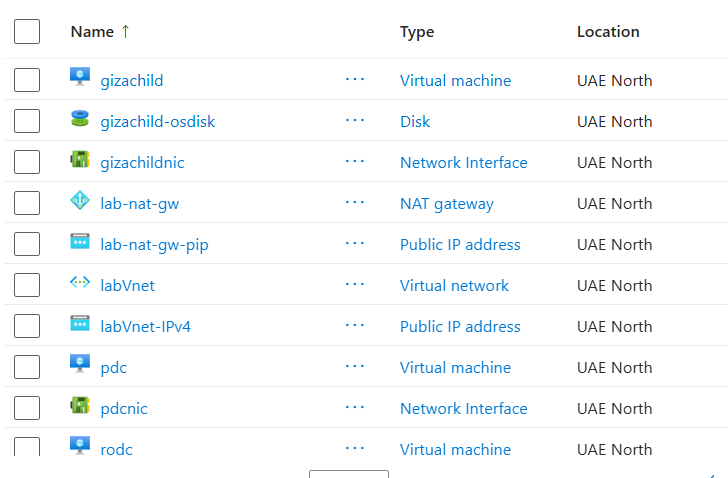
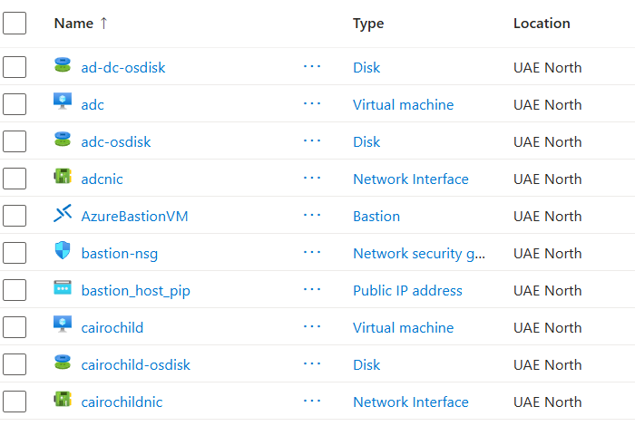
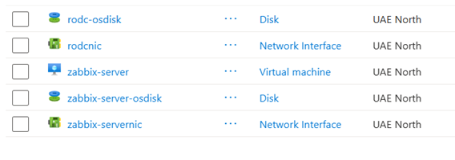

# AD with Azure Infrastructure Lab

## Overview
This project deploys a complete  Multi-Site Active Directory and Zabbix monitoring infrastructure on Microsoft Azure using Terraform. The infrastructure is defined as code (IaC) to ensure a reproducible, scalable, and automated environment for testing and lab purposes.

## Infrastructure Architecture (Terraform)

The Terraform configuration, located in the `iac/terraform` directory, automatically provisions the following resources in Azure:

### 1. Resource Group
A dedicated Azure Resource Group is created to logically group all the infrastructure components.

### 2. Networking
- **Virtual Networks (VNETs) & Subnets**: Dedicated VNETs and subnets are provisioned for isolating the different components of the architecture (e.g., PDC, ADC, RODC, Child domains, and Zabbix).
- **NAT Gateway**: A NAT Gateway (`lab-nat-gw`) is deployed and associated with all the internal subnets to allow outbound internet connectivity for the virtual machines without assigning public IP addresses to them directly.

### 3. Compute Resources (Virtual Machines)
The following Virtual Machines are deployed using custom modules:
- **PDC**: Primary Domain Controller (Root Domain).
- **ADC**: Additional Domain Controller for redundancy.
- **RODC**: Read-Only Domain Controller for a simulated branch office.
- **NasrCityChild**: Child Domain Controller (Nasr City branch).
- **GizaChild**: Child Domain Controller (Giza branch).
- **Zabbix Server**: A dedicated Ubuntu Linux VM for network and server monitoring.

### 4. Automated Post-Deployment Configuration
Terraform utilizes `azurerm_virtual_machine_run_command` and `custom_data` to automate initial guest OS configurations:
- **Zabbix Agent Installation**: A PowerShell script (`install-zabbix-agent.ps1`) is automatically executed on all Windows Server nodes to install and configure the Zabbix agent, pointing back to the central Zabbix Server IP.
- **Active Directory Role**: The `AD-Domain-Services` Windows Feature is automatically installed on all Windows VMs via a PowerShell run command.

## Prerequisites
- [Terraform](https://developer.hashicorp.com/terraform/downloads) installed locally (version 1.x or later).
- [Azure CLI](https://learn.microsoft.com/en-us/cli/azure/install-azure-cli) installed and authenticated (`az login`).
- Sufficient Azure Subscription permissions (Contributor).

## Usage (Provisioning the Infrastructure)

1. Navigate to the dev environment directory:
   ```bash
   cd iac/terraform/environments/dev
   ```

2. Initialize Terraform to download providers and modules:
   ```bash
   terraform init
   ```

3. Review the infrastructure plan:
   ```bash
   terraform plan
   ```

4. Apply the configuration to provision the resources:
   ```bash
   terraform apply
   ```

5. When you are done with the lab, you can tear down the infrastructure to save costs:
   ```bash
   terraform destroy
   ```

## Manual Configurations

While Terraform provisions the underlying network, virtual machines, and basic Windows roles, the logical Active Directory configuration and advanced Zabbix dashboard setups are performed manually. 

For complete step-by-step instructions on:
- Promoting the PDC, ADC, and RODC to Domain Controllers.
- Configuring the Child Domains (Nasr City & Giza).
- Establishing Active Directory Site and Services (Subnet mapping, Site Links).
- Configuring the Zabbix Server frontend, adding hosts, and setting up triggers.

Please refer to the comprehensive manual documentation provided in this repository:
**[`MultiSite_AD_Zabbix_Documentation final.docx`](./docs/MultiSite_AD_Zabbix_Documentation%20final.docx)**
**[`MultiSite_AD_Zabbix_Documentation final.pdf`](./docs/MultiSite_AD_Zabbix_Documentation%20final.pdf)**

## Deployed Azure Resources




