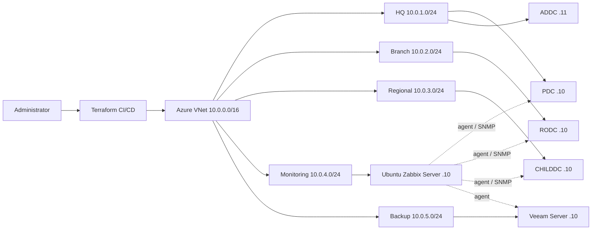

# Architecture Doc - Enterprise Hybrid AD with Azure Infrastructure Lab

## Project Name

`enterprise-hybrid-ad-with-azure-infrastructure-lab`

## Architectural Pattern

The project uses **segmented modular infrastructure**: reusable Terraform modules are composed into isolated environment roots, while the network is divided into explicit office, monitoring, and backup boundaries.

**Pattern:** Segmented modular infrastructure
**Previous project's pattern:** Not recorded in the Day 1 specification; no-repeat status requires confirmation before the next project.

## System Diagram

The diagram source is maintained at [`docs/img/architecture.mmd`](img/architecture.mmd). Render it to `docs/img/architecture.png` when publishing the Day 13 documentation.

## Two-Tier Boundary

| Tier | Component | Network placement |
| --- | --- | --- |
| Tier 1 | Domain controllers and monitored hosts | Isolated office or backup segments: `10.0.1.0/24`, `10.0.2.0/24`, `10.0.3.0/24`, and `10.0.5.0/24` |
| Tier 2 | Zabbix Server and monitoring controls | Dedicated monitoring segment: `10.0.4.0/24`; inbound monitoring access is restricted by NSG rules |

The minimum boundary is the monitoring subnet and its monitored hosts: Zabbix crosses the network boundary through controlled agent traffic on TCP 10050 and SNMP polling on UDP 161. Zabbix Server listens for active checks and trapper traffic on TCP 10051.

## Components

| Component | Responsibility | Tech |
| --- | --- | --- |
| Environment roots | Compose each deployment independently | Terraform, AzureRM provider |
| Resource group module | Own resource group and common tags | Terraform |
| Networking module | Create VNet and subnet primitives | Azure VNet, Terraform |
| Security module | Apply explicit network security rules | Azure NSG, Terraform |
| Domain hosts | Provide PDC, ADDC, RODC, and child domain services | Windows Server, AD DS |
| Monitoring host | Collect availability and performance telemetry | Ubuntu, Zabbix Server, Zabbix agents, SNMP |
| Backup host | Provide backup and replication services | Veeam Server |
| State backend | Store locked environment state | Azure Storage, Azure AD auth |

## Data Flow

1. Terraform CI validates and plans the selected environment root.
2. Azure creates the VNet, isolated segments, NSG, and optional Ubuntu monitoring host.
3. Zabbix agents on domain controllers and Linux hosts send or receive checks through the monitoring boundary.
4. Zabbix polls devices with SNMP where an agent is unavailable and records results in its database.
5. Zabbix evaluates triggers and sends an operational alert when a host or service crosses a threshold.

## Decoupling / Async Component

- **Async task:** Zabbix polling, agent collection, trigger evaluation, and alert delivery.
- **Why it can't be synchronous:** Monitoring must continue independently of any administrator request or Terraform run, and a slow or unavailable host must not block infrastructure changes.
- **Mechanism:** Zabbix server pollers, agent checks, trapper processes, and its scheduled trigger/alert workers.

## Stateful Data & Access Control

| Data store | Encryption | Identity/role | Scope (least privilege) |
| --- | --- | --- | --- |
| Azure Storage Terraform state | Azure Storage encryption at rest; HTTPS in transit | CI identity with Storage Blob Data Contributor on the state container | Read/write state blobs only; no broad subscription role |
| Zabbix database | Database encryption at rest where enabled; TLS for remote connections | Dedicated Zabbix database user | Read/write only to the Zabbix database/schema |
| Zabbix credentials and secrets | Azure Key Vault encryption at rest; TLS in transit | Managed identity or CI secret reference | Read only the named monitoring secrets |
| Host telemetry | Disk encryption; agent/server traffic restricted to approved paths | Zabbix service identity | Access to monitoring data and configuration only |

No wildcard IAM policy is required by the documented design. SSH, Zabbix, agent, and SNMP access are restricted by source network and purpose.

## Key Design Decisions

| Decision | Alternatives considered | Why this one |
| --- | --- | --- |
| Terraform modules per environment | One large root module; portal-only deployment | Supports plan review, reuse, and separate state keys for dev and prod. |
| Zabbix Server on Ubuntu | Azure Monitor only; Prometheus/Grafana | Matches the requested portable monitoring workflow and supports agents plus SNMP. |
| Five explicit `/24` segments | One flat subnet; separate VNets per site | Makes site, monitoring, and backup boundaries visible without adding unnecessary routing complexity. |
| Azure Storage remote state | Local state; unmanaged state files | Provides centralized locking and controlled CI access. |

## Pipeline

- **CI/CD:** `.github/workflows/ci.yml` and `.github/workflows/cd.yml`
- **Security passes:** Terraform formatting and validation are present; Trivy, Bandit, and pip-audit are pipeline requirements to add before production release.
- **Deployed via:**Terraform CI/CD is planned; GitOps promotion under gitops/apps/... is not implemented yet. Local terraform apply is available for lab development only and is not a production release process.

## Failure Modes

- If Terraform state storage is unreachable: planning and apply stop; no state mutation should be attempted locally.
- If an environment's VNet or subnet deployment fails: dependent compute and NSG association resources remain unprovisioned until the plan is corrected.
- If Zabbix Server is unreachable: hosts may continue running, but monitoring and alert delivery are unavailable.
- If a Zabbix agent is unreachable: that host reports unavailable while other hosts continue to be polled.
- If SNMP is unreachable: device-level telemetry is stale or unavailable; agent-based checks remain independent.
- If a domain controller is unreachable: AD availability and replication alerts depend on Zabbix's last successful check and the configured trigger thresholds.

## Defined Bottleneck

- **Predicted bottleneck (Day 1):** Zabbix Server configuration, database setup, and host enrollment are outside the base Terraform module.
- **Confirmed after build:** Revised to an implementation gap; Terraform currently provisions network primitives and optional Ubuntu compute, not a fully configured Zabbix service.
- **Current limit:** The lab does not yet guarantee a running Zabbix database, dashboard, alert channel, agent configuration, or production-grade retention policy.

## Related Docs

- [README](../README.md)
- [Day 1 scope](day-one.md)
- [Troubleshooting log](../troubleshooting.md)
