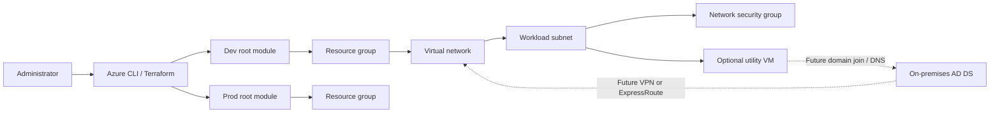

# Architecture

## Purpose

The lab models a small hybrid identity landing zone in Azure. Terraform composes reusable modules per environment, while identity-specific configuration remains an explicit operational step.

## Decisions

| Decision | Choice | Rationale |
| --- | --- | --- |
| Infrastructure language | Terraform | Reusable modules, plan review, and broad provider support. |
| State | Azure Storage backend | Centralized locking and separation from local developer machines. |
| Network boundary | One VNet with a workload subnet | Small lab footprint with a clear expansion point for domain services. |
| Security baseline | Network security group module | Keeps ingress policy versioned and reviewable. |
| Compute | Optional Linux utility VM | Provides a low-cost validation host without pretending to be a domain controller. |
| Environment isolation | Separate root modules and state keys | Prevents accidental cross-environment changes. |

## Logical topology

## Deployment boundaries

The Terraform layer owns Azure resources and network primitives. A later configuration layer should own domain controller promotion, AD replication, DNS forwarding, certificates, and secrets. This separation makes it possible to destroy and recreate the lab network without encoding domain recovery procedures in Terraform.

## Security notes

- Restrict SSH administration to a trusted CIDR; the default is intentionally empty.
- Keep secrets in Azure Key Vault or a CI secret store.
- Use managed identities and least-privilege role assignments when application workloads are added.
- Add private endpoints and Azure Policy controls before treating this as production-ready.
